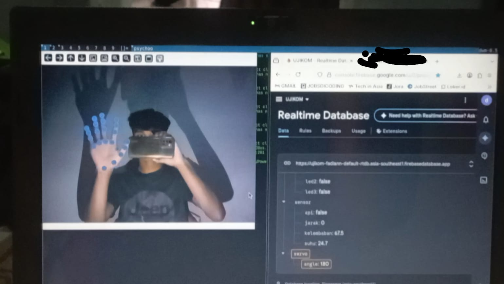

# AI-SERVO-CONTROLLER  

Proyek ini menggunakan OpenCV untuk pengenalan Jari dan Tangan. Sistem ini dibuat berdasarkan ide saya untuk membuat sistem kontrol servo menggunakan teknologi computer vision.Yang di integrasikan kedalam sebuah realtime database (FIREBASE) untuk mencatat kontrol derajat servo.Sistem ini masih memerlukan banyak perkembangan agar dapat berjalan lebih baik dan layak digunakan sebagai sebuah sarana pendidikan

## CARA PENGGUNAAN
- **Membutuhkan python 3.11.**
- Buat Akun firebase dan buat sebuah realtime database
- pergi ke Settings > ServiceAccount > buat service account dan download dalam file .json
- masukkan database url di file visi.py
- Clone / Copy semua file && direktori github (https://github.com/fadlannn69/AI-SERVO-CONTROLLER.git)
- buat sebuah virtual environment (venv)
- aktivasi virtual environment Linux(source venv/bin/activate) Windows(source venv/Scripts/activate)
- Install semua yang ada di file .[requirements.txt](requirements.txt) (python3 pip install -r requirements.txt)
- Jalankan (python3 visi.py)
